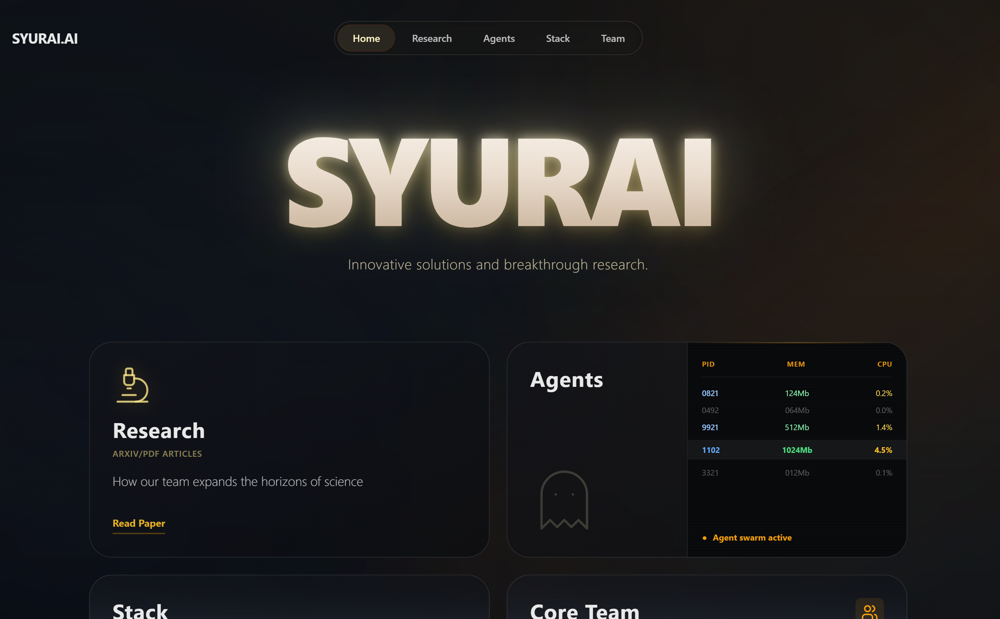

# SYURAI | Cognitive Architectures & AI Research


> **"The future of AI isn't just bigger parameters. It's about interpretable latent spaces and efficient, biological-inspired memory retrieval."**



## 🌌 Overview

**Syurai** is a research organization and digital laboratory focused on the edge of what's possible in Artificial General Intelligence (AGI) precursors. We bridge the gap between raw Large Language Model capabilities and autonomous, agentic behavior.

This repository hosts the source code for the **Syurai.ai** platform — a high-performance, immersive interface designed to showcase our research papers, cognitive architectures, and engineering stack.

## 🚀 Mission

We are moving beyond "black box" AI to pioneer:
1. **Hierarchical Memory Systems** for lifelong learning agents.
2. **Latent Space Psychology** (Zero-shot psychometrics and mechanistic interpretability).
3. **Edge AI Optimization** using Rust, custom CUDA kernels, and quantization techniques.

## ✨ Platform Features

- **Immersive UI/UX:** Built with a "dark glass" aesthetic using Tailwind CSS and complex CSS animations to reflect the depth of latent spaces.
- **Research Hub:** Dedicated rendering engine for scientific papers and pre-prints (e.g., *Zero-Shot Automatic Psychological Profiling*).
- **Agent Showcase:** Interactive presentation of our flagship products like **Motivi_AI** (Proactive Planning Assistant).
- **Interactive Team & Stack:** 3D-style visualizations of our core team and the high-performance tech stack (Polars, PyTorch, Rust) we utilize.

## 🛠 Tech Stack

The platform is engineered for speed and visual fidelity:

- **Core:** [React 18](https://react.dev/) + [TypeScript](https://www.typescriptlang.org/)
- **Build Tool:** [Vite](https://vitejs.dev/)
- **Styling:** [Tailwind CSS](https://tailwindcss.com/) + Custom CSS Animations
- **Icons:** [Lucide React](https://lucide.dev/) + [Fluent Emojis](https://github.com/Tarikul-Islam-Anik/Animated-Fluent-Emojis)
- **Deployment:** Cloudflare Pages (CI/CD)

## 📂 Project Structure

```bash
src/
├── articles/       # Scientific papers & articles (React components)
├── products/       # Product landing pages (Motivi, etc.)
├── team/           # Team member profiles (Timur, Arjun)
├── assets/         # Static assets & images
├── App.tsx         # Main routing & layout logic
├── Research.tsx    # Research hub
├── Agents.tsx      # Agent swarm visualization
├── Stack.tsx       # Tech stack grid
└── Team.tsx        # Team overview page
````

## ⚡ Getting Started

To run the laboratory interface locally:

1. **Clone the repository**

    ```bash
    git clone [https://github.com/Timur-marii8st/Syurai-Web.git](https://github.com/Timur-marii8st/Syurai-Web.git)
    cd Syurai-Web
    ```

2. **Install dependencies**

    ```bash
    npm install
    ```

3. **Run the development server**

    ```bash
    npm run dev
    ```

4. Open `http://localhost:5173` in your browser.

## 👥 Core Team

  - **Timur Sabitov** - *Founder, Cognitive Architect & Lead Researcher*
  - **Arjun Patel** - *Lead Systems Engineer (HPC, Rust, CUDA)*

## 📬 Contact

For research collaboration or investment inquiries:

  - **Email:** 4gg528@gmail.com
  - **Location:** Kazan, HQ (Global R\&D)
  - **GitHub:** [Timur-marii8st](https://github.com/Timur-marii8st)

-----

© 2025 Syurai.ai Research Lab. All rights reserved.